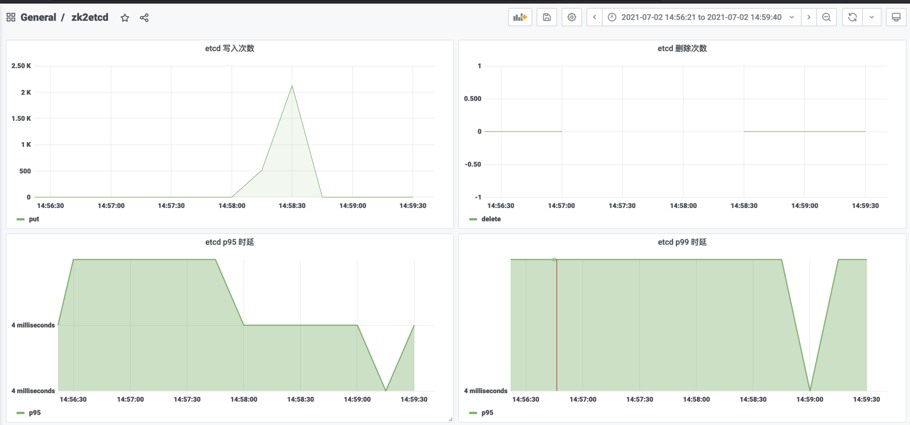
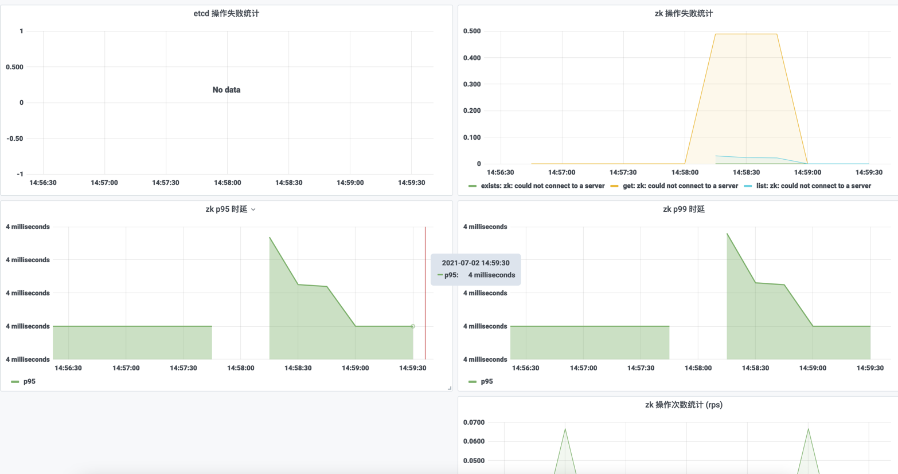

# zk2etcd

zk2etcd 是一款同步 zookeeper 数据到 etcd 的工具

## 项目背景

在云原生大浪潮下，业务都逐渐上 k8s，许多业务以前使用 zookeeper 作为注册中心，现都逐渐倾向更加贴近云原生的 etcd。

在业务向云原生迁移改造的过程中，可能需要将 zookeeper 中注册的数据同步到 etcd，且可能需要两者长期共存，实时同步增量数据。

本项目就是为了解决 zookeeper 数据同步到 etcd 而生。

## 部署

[examples](examples) 下提供部署到 k8s 的 yaml 示例。

## 变更历史

参考 [CHANGELOG](CHANGELOG.md)

## 用法

zk2etcd 主要提供 `sync` 和 `diff` 两个核心的子命令:
* sync 用于同步 zookeeper 中数据到 etcd，启动时全量同步一次，然后增量实时同步，期间还会定期全量同步进行 fix，避免 watch zookeeper 时遗漏某些 event 导致数据不一致。
* diff 用于检测 zookeeper 与 etcd 中数据的差异，也提供 fix 可选项来手动 fix 数据差异。

具体启动参数及其解释详见 help:

```bash
$ zk2etcd sync --help
sync data from zookeeper to etcd

Usage:
  zk2etcd sync [flags]

Flags:
      --concurrent uint                   the concurreny of syncing worker (default 50)
      --etcd-cacert string                verify certificates of TLS-enabled secure servers using this CA bundle
      --etcd-cert string                  identify secure client using this TLS certificate file
      --etcd-key string                   identify secure client using this TLS key file
      --etcd-servers string               comma-separated list of etcd servers address
      --fullsync-interval duration        the interval of full sync, set to 0s to disable it (default 5m0s)
  -h, --help                              help for sync
      --log-level string                  log output level，possible values: 'debug', 'info', 'warn', 'error', 'panic', 'fatal' (default "info")
      --redis-server string               redis server address (default "127.0.0.1:6379")
      --zookeeper-exclude-prefix string   comma-separated list of zookeeper path prefix to be excluded (default "/dubbo/config")
      --zookeeper-prefix string           comma-separated list of zookeeper path prefix to be synced (default "/dubbo")
      --zookeeper-servers string          comma-separated list of zookeeper servers address
```

```bash
$ zk2etcd diff --help
compare keys between zk and etcd

Usage:
  zk2etcd diff [flags]

Flags:
      --concurrent uint                   the concurreny of syncing worker (default 50)
      --etcd-cacert string                verify certificates of TLS-enabled secure servers using this CA bundle
      --etcd-cert string                  identify secure client using this TLS certificate file
      --etcd-key string                   identify secure client using this TLS key file
      --etcd-servers string               comma-separated list of etcd servers address
      --fix                               set to true will fix the data diff between zk and etcd
  -h, --help                              help for diff
      --log-level string                  log output level，possible values: 'debug', 'info', 'warn', 'error', 'panic', 'fatal' (default "info")
      --redis-server string               redis server address (default "127.0.0.1:6379")
      --zookeeper-exclude-prefix string   comma-separated list of zookeeper path prefix to be excluded (default "/dubbo/config")
      --zookeeper-prefix string           comma-separated list of zookeeper path prefix to be synced (default "/dubbo")
      --zookeeper-servers string          comma-separated list of zookeeper servers address
```

sync 启动示例:

```bash
$ zk2etcd sync
  --redis-server=redis.test.svc.cluster.local:6379 \
  --etcd-servers=etcd.test.svc.cluster.local:2379 \
  --zookeeper-servers=zookeeper.test.svc.cluster.local:2181 \
  --zookeeper-exclude-prefix=/dubbo/config,/roc/test \
  --zookeeper-prefix=/dubbo,/roc \
  --log-level=info \
  --fullsync-interval=5m \
  --concurrent=50
```

若 etcd 需要证书，可以配置下证书相关参数:
```bash
  --etcd-cacert=/certs/ca.crt \
  --etcd-cert=/certs/cert.pem \
  --etcd-key=/certs/key.pem
```

使用 diff 检测数据差异示例:

```bash
$ zk2etcd diff
  --redis-server=redis.test.svc.cluster.local:6379 \
  --etcd-servers=etcd.test.svc.cluster.local:2379 \
  --zookeeper-servers=zookeeper.test.svc.cluster.local:2181 \
  --zookeeper-exclude-prefix=/dubbo/config,/roc/test \
  --zookeeper-prefix=/dubbo,/roc \
  --log-level=info \
  --concurrent=50
```

若需要 etcd 证书，同 sync 加上证书相关参数即可。

若检测完需要立即 fix，可以再加上 `--fix` 参数。

## 部署

zk2etcd 每个版本都有对应的容器镜像 (`imroc/zk2etcd`)，tag 与 版本号一致。

通过 docker 启动示例:

```bash
$ docker run -d imroc/zk2etcd zk2etcd sync \
  --redis-server=redis.test.svc.cluster.local:6379 \
  --etcd-servers=etcd.test.svc.cluster.local:2379 \
  --zookeeper-servers=zookeeper.test.svc.cluster.local:2181 \
  --zookeeper-exclude-prefix=/dubbo/config,/roc/test \
  --zookeeper-prefix=/dubbo,/roc \
  --log-level=info \
  --fullsync-interval=5m \
  --concurrent=50
```

```bash
$ docker run -it imroc/zk2etcd zk2etcd diff \
  --redis-server=redis.test.svc.cluster.local:6379 \
  --etcd-servers=etcd.test.svc.cluster.local:2379 \
  --zookeeper-servers=zookeeper.test.svc.cluster.local:2181 \
  --zookeeper-exclude-prefix=/dubbo/config,/roc/test \
  --zookeeper-prefix=/dubbo,/roc \
  --log-level=info \
  --fullsync-interval=5m \
  --concurrent=50
```

部署到 Kubernetes 中的 YAML 示例:

```yaml
apiVersion: apps/v1
kind: Deployment
metadata:
  name: debug
spec:
  replicas: 1
  selector:
    matchLabels:
      app: debug
  template:
    metadata:
      labels:
        app: debug
    spec:
      containers:
      - name: debug
        image: imroc/zk2etcd:1.0.0
        volumeMounts:
        - mountPath: /certs
          name: etcd-certs
        command:
        - zk2etcd
        - sync
        - '--redis-server=redis.test.svc.cluster.local:6379'
        - '--etcd-servers=etcd.test.svc.cluster.local:2379'
        - '--zookeeper-servers=zookeeper.test.svc.cluster.local:2181'
        - '--zookeeper-exclude-prefix=/dubbo/config,/roc/test'
        - '--zookeeper-prefix=/dubbo,/roc'
        - '--log-level=info'
        - '--fullsync-interval=5m'
        - '--concurrent=50'
        - '--etcd-cacert=/certs/ca.crt'
        - '--etcd-cert=/certs/cert.pem'
        - '--etcd-key=/certs/key.pem'
     volumes:
     - name: certs
       secret:
         secretName: etcd-certs
---
apiVersion: v1
kind: Service
metadata:
  name: zk2etcd
  labels:
    app: zk2etcd
spec:
  type: ClusterIP
  ports:
  - port: 80
    protocol: TCP
    name: http
  selector:
    app: zk2etcd
```

## 注意事项

* 若用 k8s 部署，启动参数中若有双引号或其它特殊字符，最外层用单引号括起来，避免 yaml 格式问题导致启动失败，示例: `- '--etcd-key="/certs/key.pem"'`。
* 在 k8s 中部署且需要使用 etcd 证书，可以将证书、密钥与根证书存储到 secret 中，然后再 pod 中挂载 secret，启动参数引用相应的文件路径。

## 监控 metrics

zk2etcd 通过 80 端口 (暂时写死) 暴露 metrics，路径 `/metrics`，包含以下 metrics:
* zk2etcd_etcd_op_total: etcd 操作次数统计，以下是示例 promql
  * 统计etcd写入次数: sum(irate(zk2etcd_etcd_op_total{op="put"}[2m]))
  * 统计etcd删除次数: sum(irate(zk2etcd_etcd_op_total{op="delete"}[2m]))
  * etcd 操作失败统计: sum by (status,op)(rate(zk2etcd_etcd_op_total{status!="success"}[1m]))
* zk2etcd_etcd_op_duration_seconds: etcd操作时延统计，以下是示例 promql
  * etcd p95时延: histogram_quantile(0.95, sum(rate(zk2etcd_etcd_op_duration_seconds_bucket[1m])) by (le))
  * etcd p99时延:  histogram_quantile(0.99, sum(rate(zk2etcd_etcd_op_duration_seconds_bucket[1m])) by (le))
* zk2etcd_zk_op_total: zk 操作次数统计，以下是示例 promql
  * zk 操作失败统计: sum by (status,op)(rate(zk2etcd_zk_op_total{status!="success"}[1m]))
  * zk 各类型操作 rps: sum by (op) (irate(zk2etcd_zk_op_total[2m]))
* zk2etcd_zk_op_duration_seconds: zk操作时延统计，以下是示例 promql
  * zk p95时延: histogram_quantile(0.95, sum(rate(zk2etcd_zk_op_duration_seconds_bucket[1m])) by (le))
  * zk p99时延: histogram_quantile(0.99, sum(rate(zk2etcd_zk_op_duration_seconds_bucket[1m])) by (le))
* zk2etcd_fixed_total: 全量同步 fix 时，删除或补齐 etcd 数据次数统计(通常是增量同步时丢失event导致的部分数据不同步)
  * 统计因etcd数据缺失导致的数据补齐操作次数: sum(rate(zk2etcd_fixed_total{type="put"}[1m]))
  * 统计因etcd数据多余导致的数据删除操作次数: sum(rate(zk2etcd_fixed_total{type="delete"}[1m]))
  * 统计全部fix操作: sum(rate(zk2etcd_fixed_total[1m]))
  
grafana 面板示例:




## 迭代计划

* [x] 全量同步
* [x] 增量同步
* [x] 版本管理 (version 子命令打印详细信息, 版本号/commit/buiddate 等)
* [x] 日志增强 (自定义 level + json 输出)
* [x] 并发度控制
* [x] 数据一致性 (周期性全量检测+watch delete)
* [x] 支持配置 etcd 证书
* [x] 支持配置多个 zk prefix
* [x] 检测 zk 与 etcd 数据差异的 diff 能力
* [x] 支持 prometheus 指标监控
* [x] 容灾与自愈能力
* [x] 支持与 etcd 同步工具共存(不勿删其它同步工具写入的数据，需引入外部存储记录状态)
* [ ] 日志更丰富的自定义(如文件存储，事件日志)
* [ ] 支持动态加载配置(如日志级别)
* [ ] 日志记录事务id，将一系列操作串起来